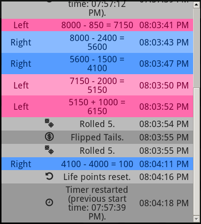
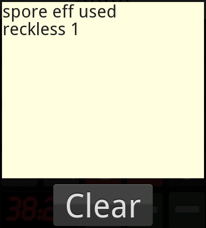
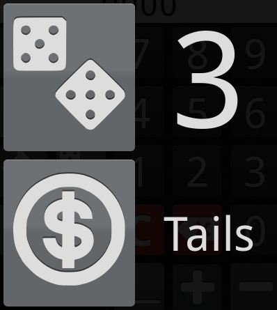

Yugioh Calculator 2014
======================

Not *just* your typical calculator app: The easiest-to-use, most-intuitive and
powerful calculator ever made for Yu-Gi-Oh! players!

Yugioh Calculator is a cross-platform application that solves all the typical
problems Yu-Gi-Oh! players face, with dead-simple controls so you can spend more
time dueling.

Available for free at
[yugiohcalculator.herokuapp.com](http://yugiohcalculator.herokuapp.com/). Bookmark it on
your mobile device today!

This repository hosts the old (2014-2016) version of Yugioh Calculator.  I've
released a newer, simpler version of the
app [here](https://github.com/jacksonrayhamilton/yugioh-calculator-2016) (and
at [www.yugiohcalculator.com](https://www.yugiohcalculator.com/)).

Intuitive Life Point Manipulation
---------------------------------

Most calculators require you to enter the entire number you want to add /
subtract. With Yugioh Calculator, you only need to enter *half*!

All the zeros in your number are already filled-out. You just need to overwrite
them. For example, click "2" to make "2000", and then "4" to make "2400". Or, to
get "600", click "0" and then "6". Then click "+" or "-" to add or subtract that
number from the currently-selected player.


It only takes 2 to 4 clicks to manipulate the life points of *any* player
by *any* amount. That's fast!

Easily reset both life points by clicking the twisty arrow button.


Expression Evaluation
---------------------

Ever played against an Evilswarm player and struggled to figure out the
difference between their attack points and yours? Avoid silly arithmetic
mistakes with Yugioh Calculator's expression evaluation: Add or substract a
bunch of numbers *before* applying the difference to someone's life.

By clicking the ">\_" button, the button will change color and you will enter
"expression evaluation mode". By clicking numbers, "+" and "-", you will build
an expression. Click the ">\_" button again to get the result of that expression.


Duel Timer
----------

Any competitive duelist knows the importance of sanctioned rounds' 40-minute
time limit. Stay ahead of your opponent by *always* knowing how much time is
left in the match.


Easily reset it by clicking the clock button.


An Undo Button
--------------

Subtracted the wrong number of life points? Undo. Accidentally reset the game?
Or the timer? Undo. Undo buttons make life better. And Yugioh Calculator is the
*only* calculator which has one.


History
-------

Everything you do in Yugioh Calculator is logged, from life point modifications
to coin flips. Never lose an argument over the current state of life points by
examining Yugioh Calculator's detailed duel history.



Rulings
-------

Get rulings for any card through Yugioh Calculator's conveniently-accessible
ruling lookup page; never waste time trudging through Google to figure out how
your cards work.


Notes
-----

Pen and paper are *no more* with Yugioh Calculator's notepad. Keep track of
whether you've used Spore's or Zephyros' effect. Clear it with a single click at
the start of your next duel.



Dice and Coins
--------------

These items are also one less thing you need to carry around. Die rolls and coin
flips also happen instantly.



Cross-Platform
--------------

Yugioh Calculator works on iPhone, iPad, Android, Windows Phone... you name it!
In fact, Yugioh Calculator even works on devices that *don't exist yet*. That's
the beauty of a web application.

No Ads!
-------

I hate ads, and I bet you do too. That's why Yugioh Calculator has *no
ads*. Never accidentally click one again.

For Developers
==============

Yugioh Calculator is an open-source project. If you know CSS or JavaScript and
want to improve this app, then by all means, fork away.

To test locally, install Node.js, Bower and Grunt, and run the following from the
project root:

```bash
npm install
bower install
grunt serve
```

and navigate to localhost:9000.

To build, run:

```bash
grunt build
```

Run either of the following to test your build in the browser:

```bash
grunt serve:dist
# Or...
npm start
```
